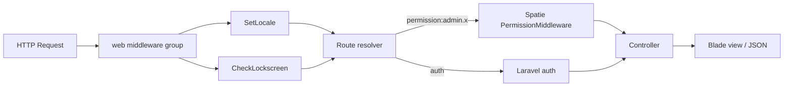
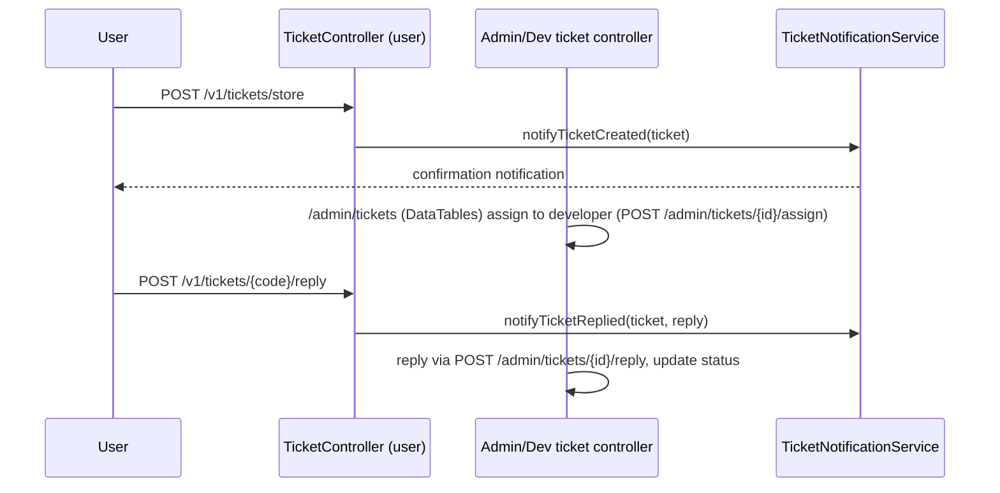
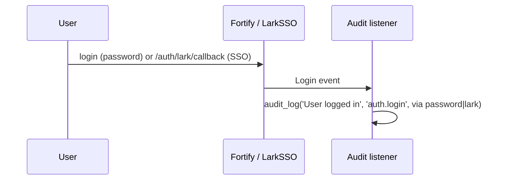

# SSOT — Single Source of Truth

> This document is the **source of truth** for how the platform works across the **`virtuenet`** and **`main`** branches.
> It is a **guide**, not a replacement for code — when a statement here contradicts the code, **the code wins**.

---

## 1. Golden Rules

| Concern | Source of truth | Command / File |
|---|---|---|
| **Routes** | Registered routes | `php artisan route:list` — `routes/web.php`, `routes/auth.php`, `routes/partials/admin.php`, `routes/partials/user.php`, `routes/api.php` |
| **Permissions** | Route names (`admin.*`) | `RoleAndUserSeeder` scans `Route::getRoutes()` and calls `Permission::findOrCreate($routeName)` |
| **DB schema** | Migrations | `database/migrations/` (fresh install: `php artisan migrate:fresh --seed`) |
| **Runtime config** | `config/` + `.env` | e.g. `config/services.php` (`lark`), `config/fortify.php`, `config/permission.php`, `config/horizon.php`, `config/pulse.php`, `config/activitylog.php`, `config/filesystems.php` |
| **Auth guards & gates** | `bootstrap/app.php`, `app/Providers/` | Gates: `viewHorizon` (admin), `viewPulse` (admin), developer bypass `Gate::before` |
| **Audit/notification helpers** | `app/Helpers/helpers.php` | `audit_log()`, `send_notification()` |
| **Docs** | `README.md` + this file | Update both whenever a feature/route changes |

---

## 2. Architecture & Request Lifecycle

**Middleware (`bootstrap/app.php`):**

- `web` group append: `App\Http\Middleware\CheckLockscreen`, `App\Http\Middleware\SetLocale`.
- Middleware aliases (Spatie): `role`, `permission`, `role_or_permission`.
- Admin routes use the `permission:` alias with the route name as the permission (e.g. `permission:admin.users.index`). There is **no** `check_permission` middleware.

**Route groups:**

| Group | Prefix | Middleware | Purpose |
|---|---|---|---|
| `web` | `/` | web | Root, `lang/{lang}`, `theme/toggle`, `global-search`, `impersonation/*`, `notifications-bell/*`, `errors/{code}`, `v1/dashboard` |
| `auth` | `/` | guest / auth | Register, password reset, confirm-password, lockscreen, Lark SSO, logout |
| `admin` (`partials/admin.php`) | `/admin` | auth + `permission:admin.*` | Users, permissions, notifications, audit-logs, feedbacks, tickets (+ developers) |
| `user` (`partials/user.php`) | `/v1` | auth | Profile (+ Sanctum tokens), user tickets |
| `api` | `/api` | `auth:sanctum` | `api.user` |
| Fortify (vendor) | `/` | web | `login`, `two-factor-challenge`, etc. |
| Horizon | `/horizon` | gate `viewHorizon` | Admin queue monitor |
| Pulse | `/pulse` | gate `viewPulse` | Admin server monitor |

**Role resolution (see `app/Models/User.php`):**

- `isDeveloper()` → has role `Developer`.
- `isAdmin()` → has role `Developer` **or** `Admin`.
- `ticketSenderType()` → `developer` | `admin` | `user`.
- Gate bypass: `Gate::before` returns `true` for developers (all permissions).

---

## 3. SSOT Sources — detail

### 3.1 Routes = source of truth for permissions

- `PermissionController::getGroupedPermissions()` and `RoleAndUserSeeder` both derive permissions from **route names**.
- `RoleAndUserSeeder::run()`:
  1. Creates/locks roles `Developer` (locked, all permissions), `Admin`, `User`.
  2. Iterates every route whose name starts with `admin.` → `Permission::findOrCreate($name, 'web')`.
  3. `Developer` gets **all** admin permissions; `Admin` gets only groups in `$adminGroups = ['users', 'tickets', 'feedbacks', 'audit-logs']`; `User` gets none.
- **To grant the Admin role a new permission**: add the module group to `$adminGroups` (or extend the group whitelist).
- **Role locking**: `roles.is_locked = 1` (Developer) prevents deletion/attribute changes. Toggled via `admin.permissions.lock`.

### 3.2 Migrations = source of truth for DB schema

Key tables: `users`, `roles`, `permissions` + pivots (Spatie), `system_notifications`, `notification_blasts`, `tickets`, `ticket_replies`, `developers`, `feedbacks`, `activity_log` (spatie/activitylog), `personal_access_tokens` (Sanctum), `jobs`/`failed_jobs`/`cache`/`sessions`, Horizon/Pulse tables.

> **`system_settings` was removed** (issue #12): the dormant `SystemSetting` model, the `system_settings` table, and their migrations (`create_system_settings_table`, `drop_legacy_system_settings_table`, `restore_system_settings_table`) were deleted because no controller/UI consumed them. If dynamic settings are ever reintroduced, restore the key-validation + cache pattern from git history and wire a real consumer (controller + UI + tests) — do **not** ship dormant infrastructure.

### 3.3 config/ + .env = source of truth for runtime config

- `config/services.php` → `lark`: `app_id`, `app_secret`, `redirect_uri`, `open_api_url`, `accounts_url`, `scope`, `allowed_domains` (all from `LARK_*` env vars).
- `config/fortify.php`: login/password-broker, rate limiters, `features` (2FA challenge enabled; registration/password-reset/verification handled by custom controllers in `routes/auth.php`).
- `config/permission.php`, `config/activitylog.php`, `config/horizon.php`, `config/pulse.php`, `config/filesystems.php` (MinIO/S3 or local `directory` disk).
- `.env.example`: defaults to `DB_CONNECTION=sqlite`; Docker dev uses MySQL via `.env.docker.example`.

---

## 4. Per-branch matrix

`main` (Silva Kit upstream) and `virtuenet` currently point at the same commit (`71bf372`) but may diverge. This section records what each branch is *supposed* to contain; **`virtuenet` is authoritative for this repo**.

| Area | `virtuenet` (this repo) | `main` (Silva Kit upstream) |
|---|---|---|
| Auth | Fortify + custom registration (auto-verify), lock screen, impersonation | Fortify, 2FA service |
| SSO | **Lark SSO** (`lark.*`, `LARK_ALLOWED_DOMAINS`) | Socialite (Google / GitHub OAuth) |
| RBAC | Spatie, permission name == `admin.*` route name, locked roles | Custom/permission models |
| Ticketing | Full flow (user / admin / developer) — `tickets`, `ticket_replies`, `developers` | — |
| Notification | Bell + blast (`notifications.bell.*`, `admin.notifications.*`) | Basic |
| Audit | spatie/activitylog (`admin.audit-logs`) | Custom audit table |
| Directory | File manager (`admin.directory.*`) | Same |
| Feedback | Feedback module (`admin.feedbacks.*`) | — |
| Queue monitor | **Horizon** `/horizon` | Custom `/admin/queues` |
| Server monitor | **Pulse** `/pulse` | Health widget (`SystemHealthService`) |
| Database tools | — | `/admin/database` |
| Settings / branding / WebSocket | — (removed, see #12) | `/admin/settings` |
| Backup | — | `/admin/backups` (spatie/laravel-backup) |
| Maintenance mode | — (dormant views only) | `/admin/maintenance` + `CheckMaintenanceMode` |

> When editing this matrix, keep it a **template** that stays valid even after divergence: document capability areas, not implementation details that rot.

---

## 5. Conventions & change workflow

### Adding a new module (e.g. `widgets`)

1. Controller: `app/Http/Controllers/System/Widget/WidgetController.php`.
2. Views: `resources/views/admin/widgets/`.
3. Routes: add to `routes/partials/admin.php` under `Route::prefix('admin')`, each route `->middleware('permission:admin.widgets.xxx')`.
4. Permissions: **automatic** — re-run the seeder (`php artisan db:seed --class=RoleAndUserSeeder`); `Developer` gains them instantly. To also grant `Admin`, add `'widgets'` to `$adminGroups`.
5. Sidebar: add link in `resources/views/layouts/partials/sidebar/admin.blade.php`, gated by the same permission via the `$canAccess(...)` closure.
6. Lang: add keys to `lang/en/messages.php` + `lang/id/messages.php`.
7. Audit / notifications: call `audit_log(...)` / `send_notification(...)` from `app/Helpers/helpers.php` as needed.
8. Tests: add Feature tests under `tests/Feature/`.
9. Docs: update `README.md` (features + structure) and this file (route matrix, conventions).

### Quality gates

- Lint: `php -l` on changed files.
- Tests: `php vendor/bin/phpunit` (SQLite `:memory:`, `QUEUE_CONNECTION=sync`, `CACHE_STORE=array` in `phpunit.xml`).
- Never commit dormant code (models/tables/controllers without a consumer) — either wire it or remove it.

---

## 6. Reference flows

### Ticket flow

### Login / audit flow

---

## 7. Keeping this doc honest

- Every batch/PR that changes routes, features, or structure must update `README.md` **and** this file in the same commit.
- Stale claims rot trust; prefer deleting a section over leaving a wrong one.
